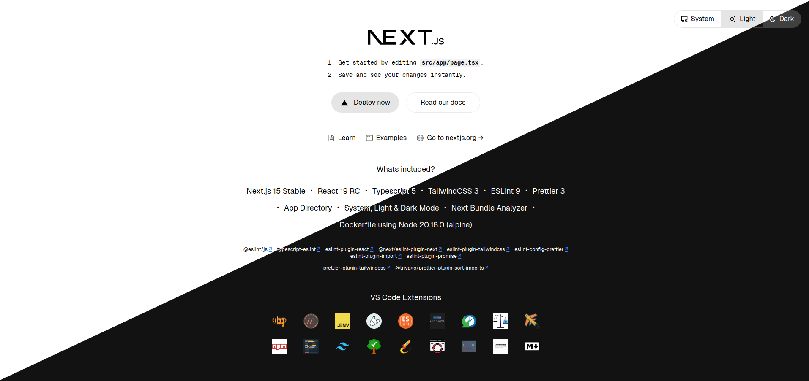

# Next.js 15 Starter (core)

Welcome to the **Next.js 15 Starter** repository! This starter template is built with Next.js 15, React 19, and TypeScript 5, and comes packed with several powerful tools and configurations to accelerate your project setup and streamline development workflows.



## 🚀 What's Included

- **Next.js 15 (Stable)**
- **React 19 (RC)**
- **TypeScript 5**
- **TailwindCSS 3**
- **ESLint 9**
- **Prettier 3**
- **App Directory with System, Light & Dark Mode**
- **Next.js Bundle Analyzer**
- **Dockerfile** with Node.js 20.18.0 (Alpine)

### 🛠️ ESLint Plugins

- **@eslint/js**
- **typescript-eslint**
- **eslint-plugin-react**
- **@next/eslint-plugin-next**
- **eslint-plugin-tailwindcss**
- **eslint-config-prettier**
- **eslint-plugin-import**
- **eslint-plugin-promise**

### ✨ Prettier Plugins

- **prettier-plugin-tailwindcss**
- **@trivago/prettier-plugin-sort-imports**

### 💻 VS Code Extensions (Recommended)

To enhance development experience, install the following VS Code extensions:

- [ESLint](https://marketplace.visualstudio.com/items?itemName=dbaeumer.vscode-eslint)
- [Prettier - Code Formatter](https://marketplace.visualstudio.com/items?itemName=esbenp.prettier-vscode)
- [Tailwind CSS IntelliSense](https://marketplace.visualstudio.com/items?itemName=bradlc.vscode-tailwindcss)
- [DotENV](https://marketplace.visualstudio.com/items?itemName=mikestead.dotenv)
- [TypeScript Hero](https://marketplace.visualstudio.com/items?itemName=rbbit.typescript-hero)

## 🏁 Getting Started

### Prerequisites

- **Node.js**: Version 20.18.0 or higher (configured in Docker)
- **Docker**: For containerized deployment (optional but recommended)

### Installation

1. **Clone the Repository**:
    ```bash
    git clone https://github.com/yourusername/nextjs-15-starter.git
    cd nextjs-15-starter
    ```

2. **Install Dependencies**:
    ```bash
    npm install
    # or with Yarn
    yarn install
    ```

3. **Run Development Server**:
    ```bash
    npm run dev
    # or with Yarn
    yarn dev
    ```

4. **Build for Production**:
    ```bash
    npm run build
    ```

### Docker Setup

To use Docker, make sure Docker is installed on your machine. Then, build and run the Docker container:

```bash
docker build -t nextjs-starter .
docker run -p 3000:3000 nextjs-starter
